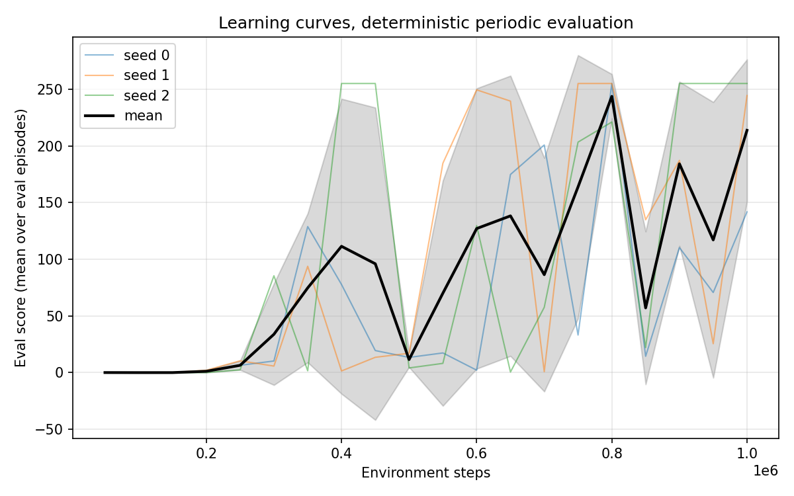

# Reinforced Flapper

[](https://github.com/tctibbs/reinforced_flapper/actions/workflows/ci.yml)

A reproducible Flappy Bird reinforcement learning pipeline: Pygame game,
Gymnasium environment, Stable-Baselines3 DQN, typed and hashed configs, a
committed results ledger, and a fixed multi-seed evaluation protocol.

Flappy Bird is a solved problem; the point of this repo is the pipeline
done right. Every headline number traces to a ledger row carrying the git
SHA, config hash, and seed that produced it.

## Results

Fixed protocol: 100 episodes with paired seeds (episode i uses seed
10000 + i), step cap 10000, deterministic policy, best checkpoint per run.
Score is pipes passed. 255 is the measurement ceiling: it means the agent
never died within the cap on any episode.

| Policy | Mean | Median | Min | Max | Capped episodes |
|---|---|---|---|---|---|
| DQN (seed 0) | 255.00 | 255 | 255 | 255 | 100/100 |
| DQN (seed 1) | 255.00 | 255 | 255 | 255 | 100/100 |
| DQN (seed 2) | 255.00 | 255 | 255 | 255 | 100/100 |
| Random policy | 0.00 | 0 | 0 | 0 | 0/100 |
| Prior shipped model | 0.00 | 0 | 0 | 0 | 0/100 |

The solved target (mean and median score >= 100 per seed, all 3 seeds,
[ADR 0005](docs/adr/0005-evaluation-protocol-and-solved-definition.md))
is met at the ceiling on every seed. Training takes about
5 minutes per seed on a laptop CPU (1M steps, headless). Stochastic
evaluation (epsilon-greedy at the saved 0.01 exploration rate) scores 13
to 18 and is reported separately in the ledger; a 1 percent random flap
rate is lethal in this game regardless of policy quality.



The live DQN policy keeps oscillating after first reaching perfect play,
which is why checkpoints are selected by periodic evaluation score rather
than taking the final network. The decisive hyperparameter was reward
scale: the original +1 alive / -100 death reward never exceeded mean 1.77,
while +0.1 / -1.0 with the same algorithm and budget reached the ceiling
([journal 003](journal/003-reward-scale-was-the-whole-problem.md),
[ADR 0007](docs/adr/0007-bounded-reward-scale.md)).

## Quick start

Requires [uv](https://docs.astral.sh/uv/).

```bash
uv sync --all-extras

# Play the game yourself
uv run flapper play

# Train (headless, no display needed), then watch the result
uv run flapper train --config configs/final.yaml --seed 0
uv run flapper watch --model runs/<run_id>/best_model

# Evaluate under the fixed protocol (appends a ledger row)
uv run flapper evaluate --model runs/<run_id>/best_model
uv run flapper evaluate --policy random

# Record an mp4 (works headless) and plot curves
uv run flapper video --model runs/<run_id>/best_model
uv run flapper plot --runs runs/<run_id> --target 100
```

`make check` runs the full quality gate: ruff check, ruff format --check,
ty check, pytest.

## How it fits together

```
src/reinforced_flapper/
  game/        Pygame game: entities, pixel-perfect collision, assets.
               Fully display-free when not rendering (docs/adr/0004).
  env.py       Gymnasium env. 4-feature observation, config-driven
               rewards, step-cap truncation, per-env seeded RNG.
  config.py    Pydantic v2 schema. Hashed (seed and name excluded) so
               every result traces to an exact configuration.
  ledger.py    Append-only results/ledger.jsonl, the source of truth.
  evaluate.py  Fixed paired-seed protocol; deterministic and stochastic
               evaluations kept separate.
  train.py     Training loop. Each run writes runs/<run_id>/ with config,
               structured log, monitor.csv, learning curve, best and
               final models, and appends a ledger row.
  video.py     Offscreen mp4 recording.
  plots.py     Learning curves and final-score plots.
  cli.py       The flapper command.
```

Decisions are recorded in docs/adr (algorithm, observation, rewards,
headless design, evaluation protocol, ledger). Experiment lessons live in
journal/, one per file.

## Reproducing

Every ledger row embeds its full config. To reproduce a row: check out
its git_sha, write its config to a YAML file (or use the matching file in
configs/), and run `uv run flapper train --config <file> --seed <seed>`.
Training is deterministic per seed up to PyTorch nondeterminism on
differing hardware; the evaluation protocol itself is exactly
reproducible for a given model.

The environment observation is 4 normalized features: bird height, bird
vertical velocity, horizontal distance to the next pipe, and vertical
distance to the gap center. Action space is flap / no flap at 30 frames
per second of game time.

## License

MIT, see LICENSE. Game assets and base game derive from
[FlapPyBird](https://github.com/sourabhv/FlapPyBird).
